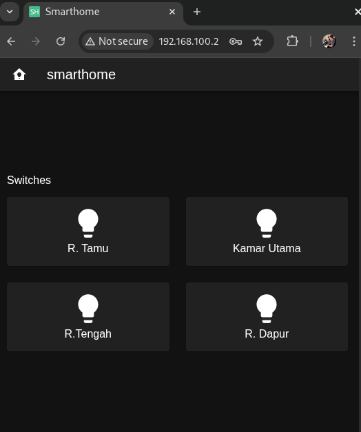
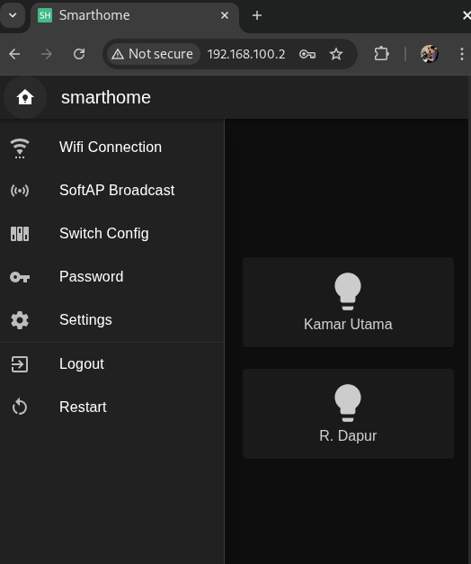
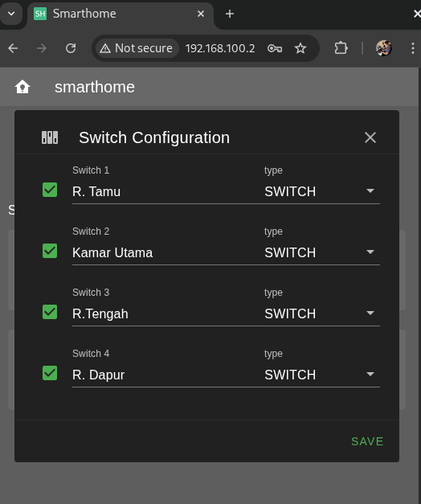

# ESP-01 Smarthome Switch Controller

A lightweight, high-performance IoT solution for controlling up to 4-channel relays using an ESP-01 (ESP8266). This project features a modern, responsive web interface built with **Vue 3** and communicates via **WebSockets** for near-instantaneous control.

## Features

* **Real-time Control:** Uses WebSockets for low-latency status updates and switching.
* **Modern UI:** Built with Vite, Vue 3, and Vuetify for a sleek, mobile-friendly "App-like" experience.
* **Dynamic Configuration:** - Rename switches directly from the UI.
    * Enable/Disable specific channels.
    * Set switch types (Switch/Pulse).

* **Network Management:** - Configure WiFi Station mode.
    * SoftAP (Access Point) broadcast settings.

* **Security:** Built-in password protection and logout functionality.
* **Efficiency:** Custom lightweight C++ HTTP server designed specifically for the limited resources of the ESP-01.

## 🛠 Tech Stack

### Client-Side

* **Framework:** Vue 3 (Composition API)
* **Build Tool:** Vite
* **UI Component Library:** Vuetify 3
* **Communication:** WebSockets (Client)

### Server-Side (Firmware)

* **Hardware:** ESP8266 (ESP-01/ESP-01S)
* **Language:** C/CPP (esp8266-rtos-sdk)
* **Communication:** WebSockets (Server) & Custom HTTP Server
* **Filesystem:** Custom


### Screenshot for 4 channel version





## Usage

1. Power the ESP-01.
2. Connect to the default Access Point (if not configured).
3. Navigate to `http://192.168.x.x` or the IP assigned by your router.
4. Login with default `admin` password.
5. Go to **Switch Config** to name your rooms.
6. Start controlling your home!

## Development

### Setup Toolchain (Compiler)

- [doc](https://docs.espressif.com/projects/esp8266-rtos-sdk/en/latest/get-started/linux-setup.html)

```sh
wget https://dl.espressif.com/dl/xtensa-lx106-elf-gcc8_4_0-esp-2020r3-linux-amd64.tar.gz
tar -xzf xtensa-lx106-elf-gcc8_4_0-esp-2020r3-linux-amd64.tar.gz

```

### Setup SDK (Library)

- [doc](https://docs.espressif.com/projects/esp8266-rtos-sdk/en/latest/get-started/index.html#get-started-get-esp-idf)

```sh
# Ubuntu 22
sudo apt-get install gcc git wget make libncurses-dev flex bison gperf python-is-python3 python3-serial
git clone --recursive https://github.com/espressif/ESP8266_RTOS_SDK.git

mkdir -p $IDF_PATH/venv
python3 -m venv $IDF_PATH/venv
. $IDF_PATH/venv/bin/activate
python3 -m pip install -r $IDF_PATH/requirements.txt

```

### Configure Project

```sh
PYTHON=python3 make menuconfig
```

### Wiring for 8 Channel

### Actuators: Shift Register 74hc595

**ESP01**
- IO2 -> DS   (Serial Data Input)
- IO0 -> SHCP (Shift Register Clock Input)
- IO3 -> STCP (Storage Register Clock Input)
- IO3 (RXD) -> OE (Try to make it smooth)

**NodeMCU**
- GPIO13 -> DS   (Serial Data Input)
- GPIO12 -> SHCP (Shift Register Clock Input)
- GPIO14 -> STCP (Storage Register Clock Input)
- GPIO16 -> OE

### Sensors: Analog Multiplexer 74hc4051

**NodeMCU:**
- ADC0   -> Z
- GPIO4  -> S0
- GPIO5  -> S1
- GPIO15 -> S2
- GPIO16 -> E


# Device ID

- Efuse
- Internal flash chip ID
- Firmware Info + time stamp ?

# 1 MB OTA

| Name     | Type | SubType | Offset  | Size    | Offset D | Size D |
| -------- | ---- | ------- | ------- | ------- | -------- | ------ |
| nvs      | data | nvs     | 0x9000  | 0x4000  | 36 KB    | 16 KB  |
| otadata  | data | ota     | 0xd000  | 0x2000  | 52 KB    | 8 KB   |
| phy_init | data | phy     | 0xf000  | 0x1000  | 60 KB    | 4 KB   |
| ota_0    | 0    | ota_0   | 0x10000 | 0x70000 | 64 KB    | 448 KB |
| ota_1    | 0    | ota_1   | 0x80000 | 0x70000 | 512 KB   | 448 KB |
|          |      |         |         |         | TOTAL    | 924 KB |